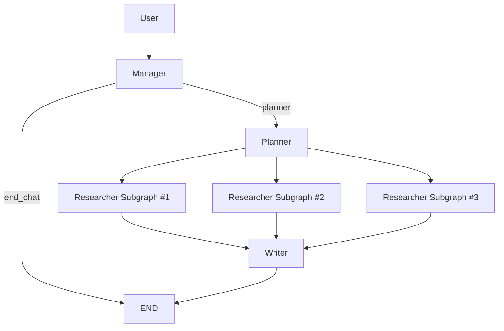

# 🕵️ Deep Research Agent (WIP)

> 基于 **LangGraph + MCP + FastAPI(SSE)** 的多智能体深度研究系统  
> A Multi-Agent Deep Research System with graph orchestration and streaming backend.
!Status [<sup>1</sup>](https://img.shields.io/badge/Status-Pre--Alpha-orange)
!Python [<sup>2</sup>](https://img.shields.io/badge/Python-3.10+-blue)
!LangGraph [<sup>3</sup>](https://img.shields.io/badge/LangGraph-StateGraph-green)
!Protocol [<sup>4</sup>](https://img.shields.io/badge/Protocol-MCP-purple)
---
## ✨ 项目亮点
- 🧠 **Graph-native Multi-Agent**：基于 LangGraph 的可扩展状态机编排（非线性链路）
- ⚡ **并发研究执行**：Planner 拆分任务，Researcher 子图并行搜索与抓取
- 🔌 **MCP 工具解耦**：搜索能力服务化，Agent 与工具边界清晰
- 🌊 **流式可观测输出**：FastAPI + SSE 实时推送 phase / token / tool 事件
- 🖥️ **端到端可运行**：后端 API + Streamlit 前端完整打通
- 🧩 **会话隔离能力**：`session_id` 接入主链路，支持多会话并行使用
---
## 📖 项目简介
传统 LLM 对话在复杂课题上容易出现信息滞后和幻觉。  
本项目尝试用 **多智能体 + 工具调用 + RAG** 的方式，模拟“研究团队”工作流：
1. **Manager** 判断是闲聊还是研究任务  
2. **Planner** 拆分可并发执行的研究子任务  
3. **Researcher 子图** 并发搜索与网页抓取  
4. **Core/RAG** 做清洗、切片、召回  
5. **Writer** 汇总生成最终回答
---
## 🧩 核心架构（当前实现）

---
```text
research-agent/
├── agents/
│   ├── manager.py
│   ├── planner.py
│   ├── writer.py
│   └── researcher/
│       ├── graph.py
│       ├── leader.py
│       ├── surfer.py
│       ├── core.py
│       └── state.py
├── api/
│   ├── routes.py
│   └── stream.py
├── bootstrap/
│   └── lifespan.py
├── frontend/
│   ├── app.py
│   ├── chat_flow.py
│   ├── backend_client.py
│   └── ui.py
├── tools/
│   ├── mcp_server_search.py
│   ├── mcp_manager.py
│   ├── rag_store.py
│   ├── registry.py
│   ├── utils_event.py
│   └── utils_message.py
├── graph.py
├── state.py
├── server.py
├── main.py
├── config.py
├── requirements.txt
├── Dockerfile
└── docker-compose.yml
```
---
## 🛠️ 技术栈
- Orchestration: LangGraph, LangChain
- Backend API: FastAPI + SSE
- Frontend: Streamlit
- Tool Protocol: MCP (fastmcp)
- Web Search / Crawl: DDGS, Trafilatura
- RAG: ChromaDB + rerank模型（本地模型目录 models/）
- Concurrency: asyncio

---

## 🚀 快速开始（按当前代码可运行）
建议 Python 3.10+
1) 安装依赖
```bash
python -m venv .venv
# Windows
.venv\Scripts\activate
# macOS/Linux
source .venv/bin/activate
pip install -r requirements.txt
```
2) 配置 `config.py`
请填入你实际使用的 API Key（如 LLM、LangSmith 等）。
3) 启动 MCP 搜索服务（终端 A）
```bash
python tools/mcp_server_search.py
```
默认监听：`http://localhost:8003`
4) 启动 FastAPI 后端（终端 B）
```bash
python server.py
```
默认监听：`http://localhost:8011`  
接口文档：`http://localhost:8011/docs`  
聊天流接口：`POST /chat`（SSE）
5) 启动 Streamlit 前端（终端 C）
```bash
cd frontend
streamlit run app.py
```

---

## 📌 当前已知限制
复杂任务在高并发时仍可能出现长尾延迟
batch_fetch 当前版本需要进一步完善：并发上限、总超时、异常隔离
前后端超时参数仍在调优中（可能出现“前端先断开”）
限流目前为内存级（重启后清零）

---

## 🗺️ Roadmap
 v0.1: LangGraph 主流程打通
 v0.2: MCP 搜索服务接入
 v0.3: FastAPI + SSE 流式后端
 v0.4: Streamlit 前端联调
 v0.5: 超时治理与稳定性优化（进行中）
 v0.6: 性能基准（成功率 / P50 / P95）
 v0.7: Docker 一键部署与文档完善
--- 

## 🧪 Benchmark（WIP）
后续会补充以下指标：

单次研究任务成功率
平均耗时（P50 / P95）
抓取阶段超时率
优化前后对比图

---

## 📝 Engineering Notes
当前处于持续迭代阶段，复杂任务场景下仍在优化长尾延迟与超时治理策略。

欢迎通过 Issue / PR 交流改进建议。