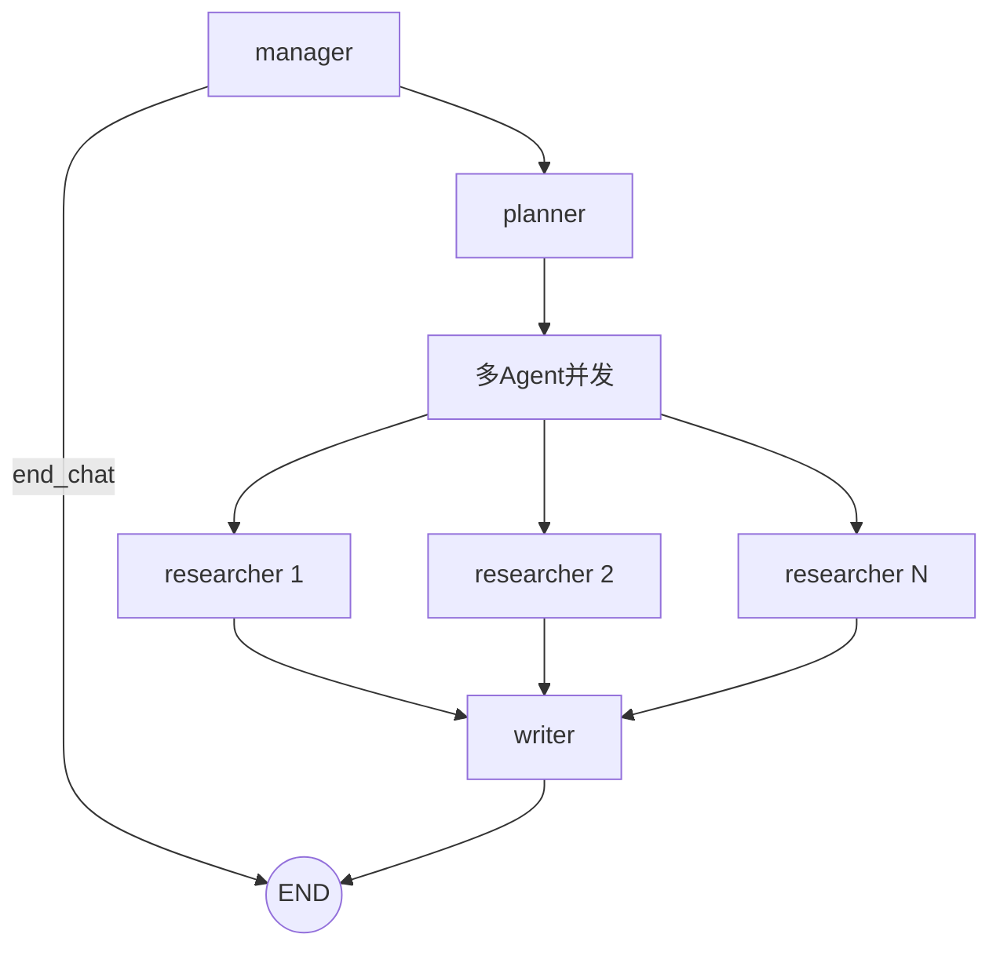
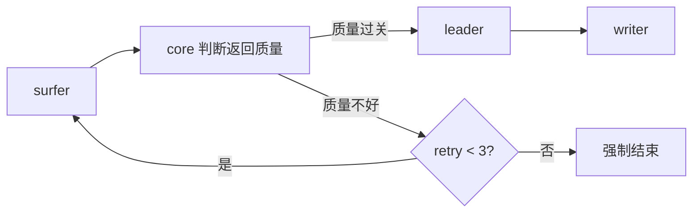
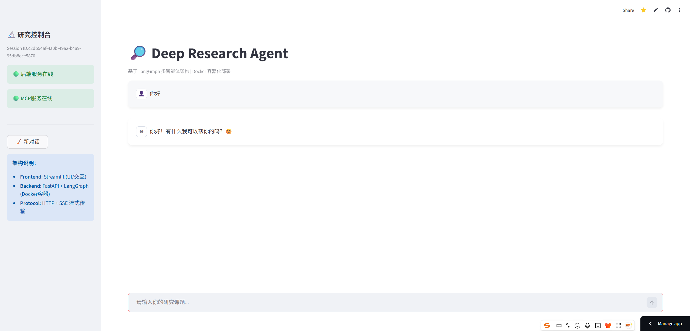
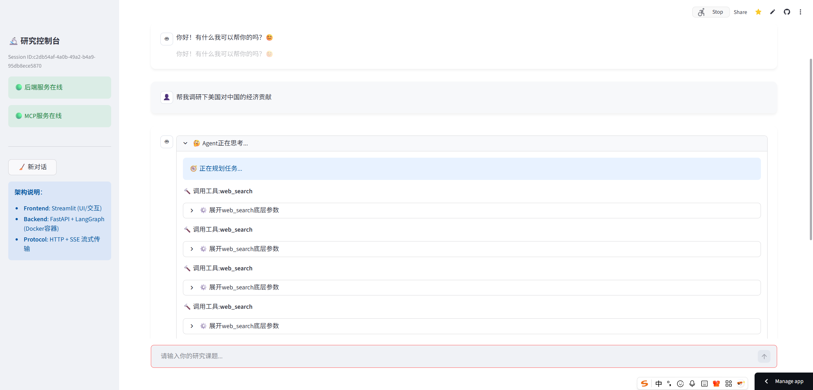
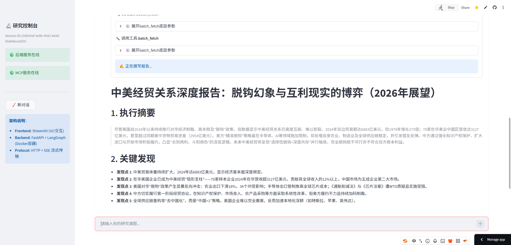

<div align="center">

# 🕵️ Deep Research Agent

> 一个可在线体验的多智能体深度研究系统  
> **LangGraph + MCP + FastAPI(SSE) + Streamlit**

[](https://annyfly.streamlit.app/)


</div>

---

## 🌐 在线体验

👉 **https://annyfly.streamlit.app/**

输入一个研究问题后，你可以实时看到：

- 任务规划（Planner）
- 工具调用（`web_search` / `batch_fetch`）
- 报告写作过程（SSE 流式输出）
- 最终结构化研究结论 + 来源引用

---

## ✨ 项目亮点

- **研究闭环**：完整的“问题 → 规划 → 检索 → 写作 → 报告”流水线
- **输出透明**：前端可见每一步执行阶段和工具调用过程
- **多 Agent 协作**：Manager / Planner / Researcher / Writer 职责清晰
- **并发执行**：Researcher 子图并发运行，复杂主题处理更高效
- **在线可用**：已部署可访问，支持真实交互体验

---

## 🧠 系统工作流






---

## 🖼️ 演示截图 / GIF

### 1) 研究过程（阶段流）



### 2) 工具调用过程（`web_search` / `batch_fetch`）



### 3) 最终报告输出



---

## 🧩 项目结构

```text
research-agent/
├── agents/
│   ├── manager.py
│   ├── planner.py
│   ├── writer.py
│   └── researcher/
│       ├── graph.py
│       ├── leader.py
│       ├── surfer.py
│       ├── core.py
│       └── state.py
├── api/
│   ├── routes.py
│   └── stream.py
├── bootstrap/
│   └── lifespan.py
├── frontend/
│   ├── app.py
│   ├── chat_flow.py
│   ├── backend_client.py
│   └── ui.py
├── tools/
│   ├── mcp_server_search.py
│   ├── mcp_manager.py
│   ├── rag_store.py
│   ├── registry.py
│   ├── utils_event.py
│   └── utils_message.py
├── graph.py
├── state.py
├── server.py
├── main.py
├── config.py
├── requirements.txt
├── Dockerfile
└── docker-compose.yml
```

---

## ⚡ 快速开始

本项目推荐部署方式：

- 前端：Streamlit Cloud（推荐）
- 后端：自有服务器 Docker / docker-compose


1) 后端部署（Docker）
```bash
git clone https://github.com/Annyfee/research-agent.git
cd research-agent
cp .env.example .env
vim .env
# 填好后端需要的 API Key 等配置
docker compose up -d --build
```

2) 前端部署（Streamlit Cloud，推荐）
- Main file: frontend/app.py
- 在 Streamlit Cloud 的 Secrets 里配置：
```toml
BACKEND_URL = "http://<你的服务器IP>:8011"
```

3) 本地运行前端（可选）
如果你不是用 Streamlit Cloud，而是本地跑前端，就在 frontend/.env 配：
```env
BACKEND_URL=http://localhost
```

---

## 🛠️ 技术栈

- **Orchestration**: LangGraph, LangChain
- **Backend**: FastAPI + SSE
- **Frontend**: Streamlit
- **Tool Protocol**: MCP (fastmcp)
- **Search/Crawl**: DDGS, Trafilatura
- **RAG**: ChromaDB + rerank model
- **Runtime**: asyncio
- **Deploy**: Docker / docker-compose

---

## 🤝 交流与反馈

如果你对多智能体编排、SSE 流式交互、MCP 工具扩展有想法，欢迎提 **Issue / PR**。

如果这个项目对你有帮助，欢迎点个 **⭐ Star**！