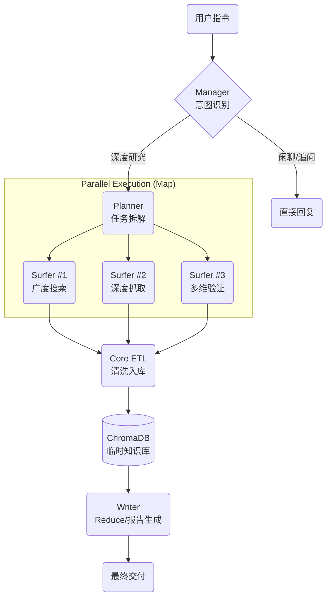

# 🕵️ Deep Research Agent (WIP)

> **基于 LangGraph 与 MCP 架构的分布式深度研究智能体集群**  
> *An Autonomous Research Swarm based on Map-Reduce Architecture*


---

## ⚠️ Current Status: Pre-Alpha (Demo Ready)

本项目目前处于 **核心逻辑跑通 (Core Logic Verified)** 阶段。  
主要展示了 **LangGraph 状态机编排**、**MCP 工具协议** 以及 **Asyncio 高并发采集** 的最小可行性实现 (MVP)。  

后端服务化 (FastAPI)、多用户隔离及容器化部署 (Docker) 正在紧锣密鼓地开发中。

---

## 📖 项目简介 (Introduction)

传统的 LLM 对话往往受限于“幻觉”和“训练数据滞后”。  
**Deep Research Agent** 不仅仅是一个聊天机器人，它是一个模仿人类高级研究员工作流的**智能体集群**。

它采用 **Map-Reduce** 分布式架构：

1. **Planner** 将模糊的课题拆解为多个并行子任务  
2. **Surfer Swarm** (搜索集群) 并发执行全网搜索与爬取  
3. **Core** 进行实时的 ETL (清洗、切片、向量化)  
4. **Writer** 基于 RAG 知识库生成万字深度报告

## 🌟 核心特性 (Key Features)

### 1. 🧠 Agentic Map-Reduce 架构
摒弃线性的 Chain 结构，采用 **LangGraph** 构建有环图。

- **动态规划**：Planner 根据上下文自动拆解 3-5 个搜索方向  
- **自我纠错**：Manager 节点具备意图识别能力，自动拦截闲聊，仅对复杂任务启动研究集群

### 2. ⚡ 异步高并发采集 (Async High-Concurrency)

- 解决了 Python GIL 下的 I/O 阻塞痛点  
- 基于 `httpx` 和 `asyncio` 实现 **5+ Agent 并行作业**  
- 单次深度研究任务（含 20+ 网页抓取）从传统串行的 10 分钟压缩至 **1-2 分钟**

### 3. 🔌 MCP 标准化协议 (Model Context Protocol)

- 遵循 2025 前沿标准，通过 `fastmcp` 构建独立的搜索微服务  
- 实现了 Agent 逻辑与工具实现的彻底解耦，易于扩展

### 4. 🧹 实时 Web RAG 管道

- **ETL Pipeline**：`Jina Reader` (解析) → `Regex` (降噪) → `RecursiveSplitter` (切片)  
- **Hybrid Search**：集成 ChromaDB 向量检索与 Flashrank 重排序 (Rerank)，大幅降低幻觉率

---


## 🗺️ 架构设计 (Architecture)



## 🛠️ 技术栈 (Tech Stack)

- **Orchestration**: LangGraph, LangChain
- **LLM Integration**: DeepSeek-V3 (via OpenAI Compatible API)
- **Protocol**: Model Context Protocol (MCP)
- **Search & Data**: DuckDuckGo (Async), Jina Reader, ChromaDB, Flashrank
- **Concurrency**: Asyncio, Httpx

## 📂 项目结构 (Project Structure)

```plaintext
deep-research-agent/
├── agents/                    # 智能体定义
│   ├── manager.py            # 前台经理 (意图识别)
│   ├── planner.py            # 规划师 (任务拆解)
│   ├── surfer.py             # 冲浪者 (执行搜索)
│   ├── core.py               # 数据工程师 (ETL入库)
│   └── writer.py             # 撰稿人 (报告生成)
├── tools/                     # 工具与基础设施
│   ├── mcp_server_search.py  # MCP搜索微服务
│   ├── rag_store.py          # RAG 向量库封装
│   └── utils.py              # 通用中间件
├── main.py                    # 系统入口 (控制台交互版)
├── config.py                  # 全局配置
└── requirements.txt           # 依赖清单
```

## 🚧 开发路线图 (Roadmap)

- [x] v0.1 Core: 完成 LangGraph 闭环，跑通 Map-Reduce 流程
- [x] v0.2 Performance: 实现 mcp_server 的全异步改造，解决并发阻塞
- [x] v0.3 Intelligence: 优化 Manager 意图识别，防止非任务指令误触
- [x] v0.4 Isolation (In Progress): 实现基于 session_id 的多用户 RAG 隔离
- [x] v0.5 Backend: 封装 FastAPI 接口，支持 SSE 流式输出
- [ ] v0.6 Frontend: 集成 Streamlit 可视化驾驶舱
- [ ] v1.0 DevOps: Docker 容器化封装，实现一键部署


# 🚀 快速开始 (Quick Start)

> **注意**：本项目需要访问外部 API (DeepSeek, DuckDuckGo)，请确保网络环境畅通。

## 1. 克隆仓库

```bash
git clone https://github.com/YourUsername/deep-research-agent.git
cd deep-research-agent
```

## 2. 配置环境
推荐使用 Python 3.10+
```bash
python -m venv venv
source venv/bin/activate          # Windows: venv\Scripts\activate
pip install -r requirements.txt
```

## 3. 配置 API Key
在 config.py 或环境变量中填入你的 API Key:
```python
# config.py
OPENAI_API_KEY = "sk-xxxx"
EMBEDDING_API_KEY = "sk-xxxx"
```

## 4. 启动 MCP 服务 (新终端)
```bash
python tools/mcp_server_search.py
```

## 5. 启动主程序
```bash
python main.py
```